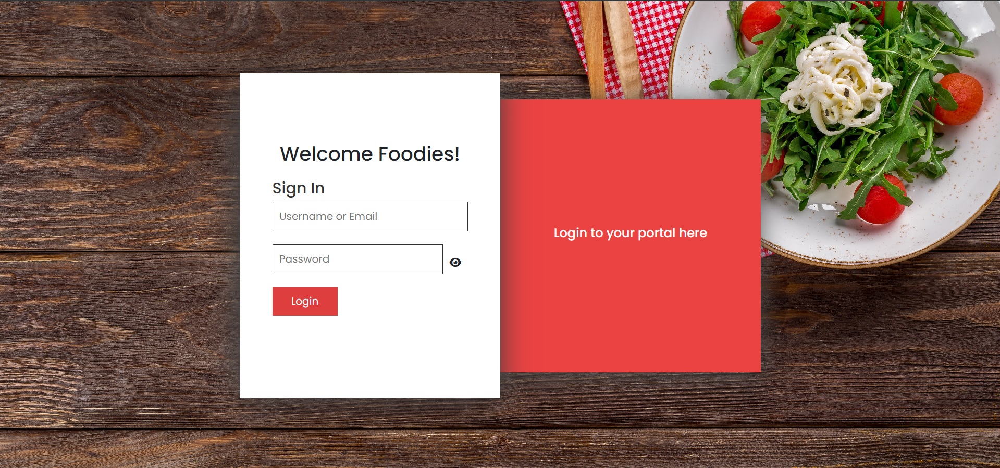
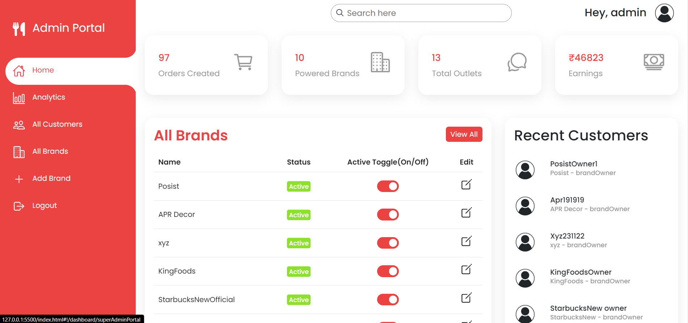
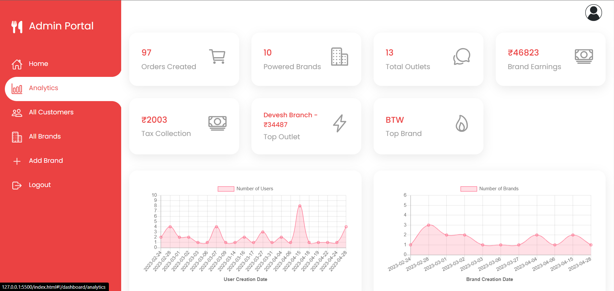
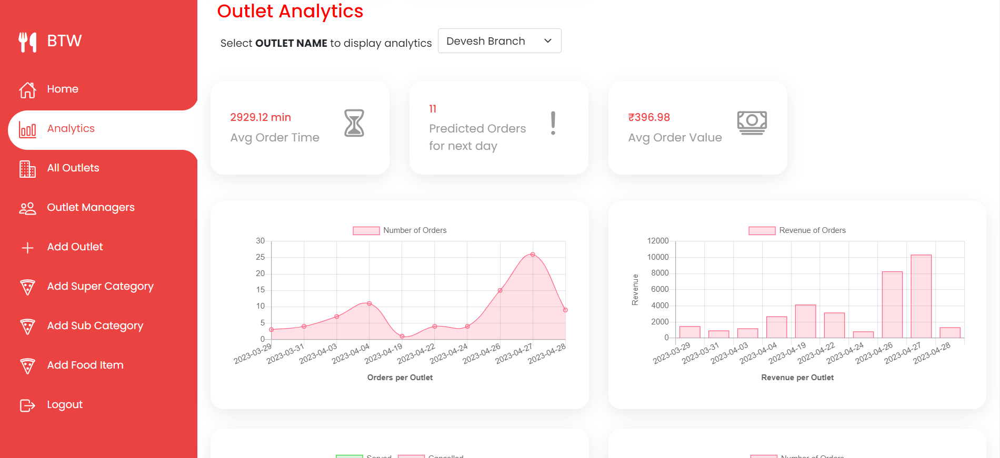
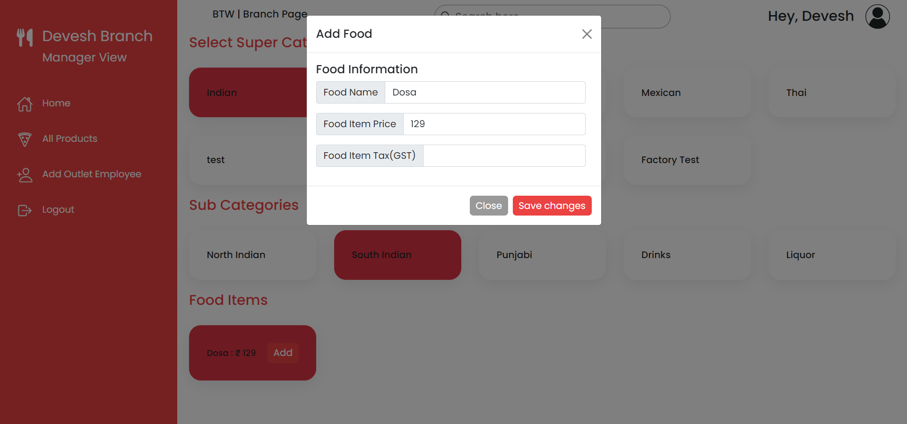
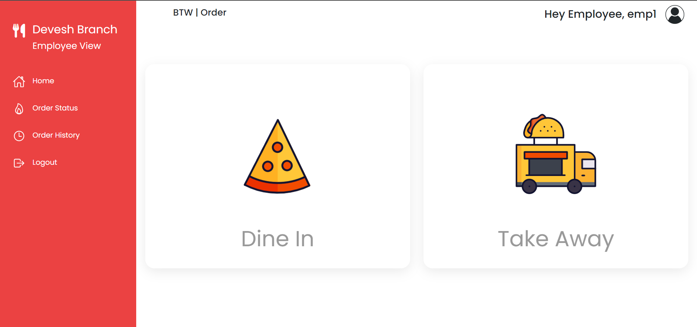
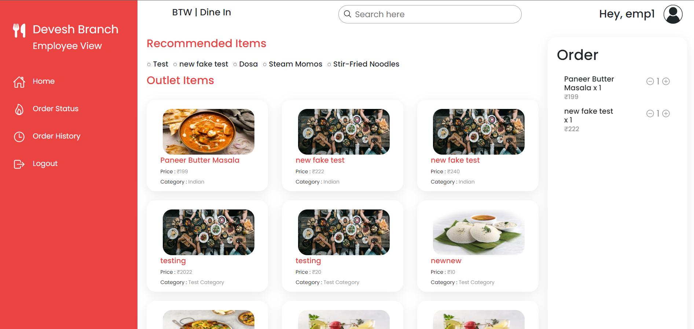

## Food Ordering App 💻

* A food ordering app followed by multi-tenant architecture.
* Demonstration of the Web App : 

### Features Accomplished 🤩
* User Login and creation
* Different levels of admins
* Food ordering
* Creating users, brands, outlets, food items, etc.
* Analytics on each level			

### Technology Decisions 👩🏻‍💻
* **IDE** : Visual Studio Code
* **Platform** : 
	 * Vercel
	 * Heroku
* **Libraries** : AngularJS
* **Framework** : Express
* **Runtime Environment** : Node.JS
* **Version Control System :** GitHub
* **Database :** MongoDB
* **Languages** :
	* HTML
	* CSS
	* JavaScript
### Agile Methodology 🏃
Agile is a chain of development in which specific set of tasks are performed iteration wise according to the priority. I divided the web App into smaller chunks and worked on each of them separately. Agile methodology taught me how to work flawlessly and in an organized manner.

### Download Files 👇
* Go to my GitHub repository: https://github.com/dudenayak/FoodOrderingApp-Frontend
* Download Zip or clone repository
* Then open the folder in your IDE 

### Install the Dependencies ✌️

Go to my GitHub repository: https://github.com/dudenayak/FoodOrderingApp-Backend

```shell
# run yarn install or npm install
npm install
```

### Run the App 😻

```shell
# to start the Server, type
npm start
```
Runs the app in the development mode.

Open [http://127.0.0.1:5500/index.html#!/](http://127.0.0.1:5500/index.html#!/) to view the functioning of client side in the browser. 


### Glimpses 📷
 **Login Page** 👋  

 **SuperAdmin View** 👨‍💼 

 **Analytics** 📊  

 **Brand Level Analytics** 📈  

 **Adding Food Items** 🥗  

 **Food Ordering Page** 🍴  

 **Cart Page** 🛒  

 